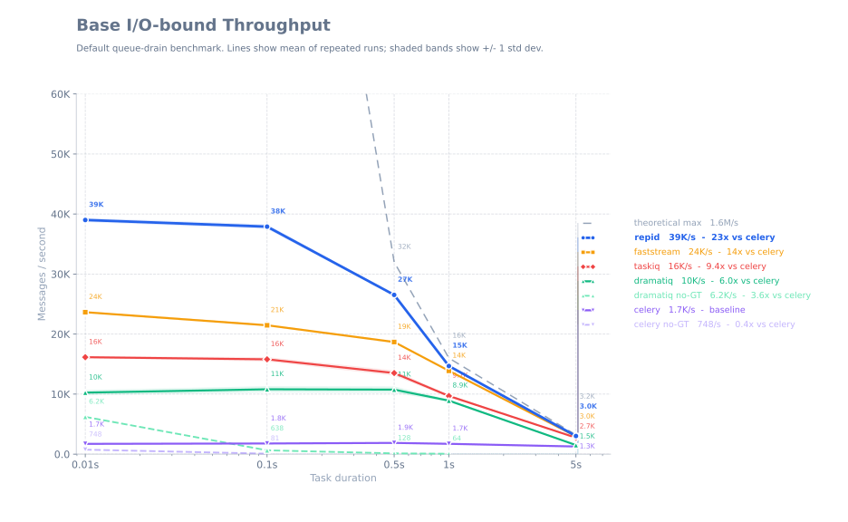

# Benchmarks

???+ Note "Disclaimer"
    The benchmarks presented here are intended to provide insight into the performance
    of the tested software under specific conditions.
    Benchmarks should never be the sole factor in decision-making.

    All tests were performed on the same machine, equipped with an 8-core/16-thread processor.
    The top performers (Repid, Faststream, and Dramatiq with gevent) utilized up to
    100% of CPU resources, suggesting they may achieve even better results on higher-end CPUs.
    Naturally, absolute results will vary across different systems.

    You are strongly encouraged to replicate these benchmark results in your own environment.
    For reference, please consult the [benchmark repository](https://github.com/aleksul/repid-benchmarks).

    Finally, keep in mind that benchmarking is a complex process influenced by many factors.
    Readers are encouraged to design and run their own benchmarks tailored to
    their specific use cases and environments.

## Methodology

These benchmarks evaluate the sustained processing rate (messages per second) for a simple,
I/O-bound worker task across several Python task queue libraries. The primary objective is to
compare end-to-end throughput when dispatching numerous short, I/O-like jobs,
rather than profiling internal library mechanics.

Benchmark specifics:

- Task: Sleep for n seconds (to simulate an I/O-bound operation), then increment a shared counter.
  The counter verifies the total number of completed messages.
- Each reported value represents the mean ± standard deviation over 5 runs.
- Message counts were selected so that each run lasts approximately 45 seconds,
  ensuring each framework operates under full load.
- RabbitMQ served as the message broker for all tested libraries.
- Where applicable, both synchronous and green-threaded variants were tested.
  Note that green-threaded runs require monkey-patching, which can alter program behavior.
- Asyncio-native frameworks were executed using `uvloop`.

## What the chart shows

The chart below illustrates the measured throughput (messages per second) for each
library and configuration.
Higher values indicate greater raw throughput for the test workload described above.

Interpretation notes:

- These benchmarks measure I/O-bound throughput with a fixed sleep duration per message.
  Real-world analogues include database calls (~0.1 sec), API calls (~1.0 sec), and similar operations.
- A higher message rate means the library completed more simulated I/O jobs per second
  on the test machine. This allows for a comparison of library efficiencies with each other
  and against a theoretical maximum
  (calculated as `8 processes * 2000 concurrency * (1/n seconds wait)`).

## Chart

(click on the chart to zoom in)
