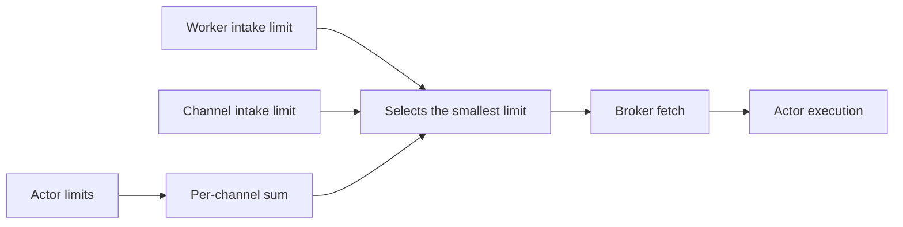

# Concurrency Limits

Concurrency limits keep a worker from taking more work than it can handle.
For example, you can use them to protect memory, database pools, external services, etc.

Repid has built-in numeric limits and application-defined limit policies:

| Type | Scope | Control |
| --- | --- | --- |
| `MessageLimits` | Worker and channel | Numeric broker-intake capacity |
| `ActorLimits` | Router and actor | Numeric post-routing execution capacity |
| `LimitPolicyT` | Every scope | Application-defined execution reservations |

=== "MessageLimits"

    ```python
    from repid import BackpressurePolicy, OnOversizedPayloadT

    MessageLimits(
        max_messages: int | None = None,
        max_payload_bytes: int | None = None,
        on_oversized_payload: OnOversizedPayloadT = "run_alone",
        backpressure: BackpressurePolicy | None = None,
    )
    ```

=== "ActorLimits"

    ```python
    from repid import OnOversizedPayloadT

    ActorLimits(
        max_messages: int | None = None,
        max_payload_bytes: int | None = None,
        on_oversized_payload: OnOversizedPayloadT = "run_alone",
    )
    ```

- `max_messages` is the maximum number of in-flight messages. Use a positive integer or `None`.
- `max_payload_bytes` is the maximum total size of in-flight payloads. Use a positive
  integer or `None`.
- `on_oversized_payload` defines what happens when one payload is larger than a built-in
  byte limit. Can be `run_alone`, `reject`, `nack`, or a function that defines the policy
  `Callable[[ReceivedMessageT], Literal["run_alone", "reject", "nack"]]`.
- `backpressure` (MessageLimits only) controls intake while execution waits. `None` inherits the
  worker setting. See [Backpressure](#backpressure).

## Default worker limit

A worker admits up to 1,000 messages by default:

```python
await app.run_worker()  # MessageLimits(max_messages=1000)
```

To remove this limit, pass an empty limits object:

```python
await app.run_worker(limits=MessageLimits())
```

Routers and actors have no default limits.

??? Note "Why is the default 1,000 messages?"
    In tests, the processing overhead of receiving and scheduling about 1,000 to 2,000 no-op
    messages can saturate one CPU core. This number is based on Repid's
    message-consumption overhead, does not include any work done by your actors.

    When a worker takes more messages than its CPU can process, it can also take work away from
    less busy workers, thus the whole system becomes less efficient.
    The best value depends on your CPU, broker, and actors.
    Measure your workload and adjust the limit.

## Applying limits

Add limits at the scopes that own the resource:

```python
from repid import ActorLimits, Channel, MessageLimits, Router

router = Router(
    # All actors in this router share 20 execution slots.
    limits=ActorLimits(max_messages=20),
)


@router.actor(
    channel=Channel(
        address="video_jobs",
        # This channel may hold 100 messages or 256 MiB per worker.
        limits=MessageLimits(
            max_messages=100,
            max_payload_bytes=256 * 1024 * 1024,
        ),
    ),
    # This actor may run four calls at once.
    limits=ActorLimits(max_messages=4),
)
async def transcode(video_id: str) -> None: ...


# This worker may hold 500 messages across all channels.
await app.run_worker(limits=MessageLimits(max_messages=500))
```

### Sharing capacity

Reuse the same limits object to share capacity, or create one per actor to isolate them:

=== "Shared limits object"

    ```python
    # One object shared by both actors: the 12 slots are a common pool.
    database = ActorLimits(max_messages=12)


    @router.actor(channel="imports", limits=database)
    async def import_rows() -> None: ...


    @router.actor(channel="reports", limits=database)
    async def build_report() -> None: ...
    ```

    Both actors together can use 12 slots. For example, if `import_rows` is running on all
    12 slots, `build_report` waits until a slot is released.

=== "Separate limits objects"

    ```python
    # Two distinct objects: each actor gets its own independent pool of 12 slots.
    database_1 = ActorLimits(max_messages=12)
    database_2 = ActorLimits(max_messages=12)


    @router.actor(
        channel="imports",
        limits=database_1,  # 12 slots for this actor only
    )
    async def import_rows() -> None: ...


    @router.actor(
        channel="reports",
        limits=database_2,  # 12 more slots for this actor only
    )
    async def build_report() -> None: ...
    ```

    **Each** actor gets 12 slots, so up to 24 calls can run at once. One actor running on
    all of its slots never delays the other.

## Actor limits and broker intake

By default, Repid uses actor limits to reduce how much each channel fetches.
This prevents a worker from holding many messages that cannot run.



For example:

```python
@router.actor(channel="jobs", limits=ActorLimits(max_messages=3))
async def resize() -> None: ...


@router.actor(channel="jobs", limits=ActorLimits(max_messages=5))
async def index() -> None: ...
```

Repid can propagate an intake cap of 8 messages for channel `jobs`.
The actor limits still enforce 3 `resize` actor calls and 5 `index` actor calls.

Repid propagates each numeric field only when every actor on the channel has a finite limit for that
field. An actor without a byte limit prevents byte-limit propagation for that channel.

Disable propagation when you prefer explicit intake limits:

```python
await app.run_worker(actor_limits_propagation="off")
```

## Backpressure

Backpressure defines what intake does while an actor waits for capacity.

Default backpressure policy:

```python
from repid import BackpressurePolicy, MessageLimits

limits = MessageLimits(
    backpressure=BackpressurePolicy(
        strategies=("native", "channel_pause", "worker_pause"),
        on_unavailable="buffer",
        resume_at=0.75,
    ),
)
```

Available strategies:

| Strategy | Behavior |
| --- | --- |
| `"native"` | Let the broker's own flow-control window bound delivery. |
| `"channel_pause"` | Soft-pause the affected channel. |
| `"worker_pause"` | Soft-pause the worker subscription. |
| `"resubscribe"` | Permit an expensive unsubscribe/resubscribe cycle. |

Strategies are tried in the declared order.

`on_unavailable` has to be either `"buffer"` or `"error"`.
`"buffer"` means that messages will pile up in the consumer's memory,
while `"error"` means that repid will check strategies availability in advance and fail eagerly.

Broker advertises supported options via server capabilities; see
[Your own brokers](../../advanced_user_guide/your_own_brokers.md).

For example, require native flow without any fallback:

```python
native_only = BackpressurePolicy(
    strategies=("native",),
    on_unavailable="error",
)
```

To always buffer within the intake limits without pausing, use empty strategies:

```python
buffer = BackpressurePolicy(strategies=(), on_unavailable="buffer")
```

### Reducing pause and resume churn

When the selected strategy is `"channel_pause"`, `"worker_pause"`, or `"resubscribe"`,
Repid waits until the limit usage falls to `resume_at` or lower before resuming intake:

```python
# Pause at 1,000 active messages. Resume after usage falls to 750 or lower.
policy = BackpressurePolicy(resume_at=0.75)
limits = MessageLimits(max_messages=1000, backpressure=policy)
```

The default is `0.75`. Lower values reduce pause/resume churn.
`resume_at` is ignored when native flow or buffering handles the wait.

## Oversized payloads

`on_oversized_payload` applies when one payload is larger than `max_payload_bytes`.

| Value | Result |
| --- | --- |
| `"run_alone"` | Wait for current work to complete, then run this message alone. |
| `"nack"` | Nack without running the actor. |
| `"reject"` | Reject without running the actor. |

`"run_alone"` is the default. It makes `max_payload_bytes` a concurrency budget, not a maximum
allowed payload size. A waiting oversized payload gets priority over later, smaller messages.

The policy can also be a synchronous function. Repid passes the received message and uses the
returned action:

```python
from repid import OversizedPayloadAction
from repid.connections import ReceivedMessageT


def choose_on_oversized_payload(message: ReceivedMessageT) -> OversizedPayloadAction:
    if message.headers and message.headers.get("priority") == "critical":
        return "run_alone"
    return "nack"


limits = MessageLimits(
    max_payload_bytes=10 * 1024 * 1024,
    on_oversized_payload=choose_on_oversized_payload,
)
```

## Custom limit policies

A `LimitPolicyT` is an asynchronous reservation strategy. It receives the message, selected actor,
and an `on_wait` callback:

```python
from collections.abc import Awaitable, Callable
from repid import LimitPolicyT, ReservationLeaseT
from repid.connections import ReceivedMessageT
from repid.data import ActorData


class WorkLimitPolicy:
    async def reserve(
        self,
        message: ReceivedMessageT,
        actor: ActorData,
        on_wait: Callable[[], Awaitable[None]],
    ) -> ReservationLeaseT: ...
```

The policy calculates cost and reserves capacity. If it must wait, it calls `await on_wait()` once
before blocking, then returns a reservation lease. The lease must provide an async, idempotent
`release()` method. Repid holds it until processing ends.

Here is a local policy where each message costs one work unit:

```python
import asyncio


class WorkLease:
    def __init__(self, policy: "WorkLimitPolicy") -> None:
        self.policy = policy
        self.released = False

    async def release(self) -> None:
        async with self.policy.ready:
            if self.released:
                return
            self.released = True
            self.policy.used -= 1
            self.policy.ready.notify_all()


class WorkLimitPolicy:
    def __init__(self, capacity: int) -> None:
        if capacity < 1:
            raise ValueError("capacity must be positive")
        self.capacity = capacity
        self.used = 0
        self.ready = asyncio.Condition()

    async def reserve(self, message, actor, on_wait):
        async with self.ready:
            if self.used < self.capacity:
                self.used += 1
                return WorkLease(self)

        await on_wait()
        async with self.ready:
            await self.ready.wait_for(lambda: self.used < self.capacity)
            self.used += 1
            return WorkLease(self)


work: LimitPolicyT = WorkLimitPolicy(capacity=100)
```

Custom limit policies are never translated to broker-native limits or propagated to channel intake.

If pricing can fail, handle the fallback inside `reserve()`.
Repid treats an unhandled policy error as a worker failure: it stops new intake
and marks the worker unhealthy when health checks are enabled.

A policy may use shared storage to enforce one limit across worker processes.
However, keep in mind that its leases should expire or otherwise release capacity
if a worker would crash.

### Applying custom limit policies

Pass `limit_policies=` at any scope, the same way as `limits=`. Repid deduplicates policies by
identity, so a message reserves capacity in the same policy only once, even when that policy
appears at several scopes on its way through the worker:

=== "Same policy instance"

    ```python
    from repid import Channel, Router

    # One instance reused at every scope: capacity=100 is a single global pool.
    work: LimitPolicyT = WorkLimitPolicy(capacity=100)  # defined in "Custom limit policies" below

    channel = Channel(address="jobs", limit_policies=(work,))
    router = Router(limit_policies=(work,))


    @router.actor(channel=channel, limit_policies=(work,))
    async def process() -> None: ...


    await app.run_worker(limit_policies=(work,))
    ```

    A message for `process` passes through the worker, the `jobs` channel, the router, and
    the actor, all sharing the same `work` policy instance.
    Repid reserves a single slot for it, so 100 messages can run at once.

=== "Separate policy instances"

    ```python
    from repid import Channel, Router

    # Four distinct instances: every scope enforces its own independent pool of 100.
    worker_policy: LimitPolicyT = WorkLimitPolicy(capacity=100)
    channel_policy: LimitPolicyT = WorkLimitPolicy(capacity=100)
    router_policy: LimitPolicyT = WorkLimitPolicy(capacity=100)
    actor_policy: LimitPolicyT = WorkLimitPolicy(capacity=100)

    channel = Channel(address="jobs", limit_policies=(channel_policy,))
    router = Router(limit_policies=(router_policy,))


    @router.actor(channel=channel, limit_policies=(actor_policy,))
    async def process() -> None: ...


    await app.run_worker(limit_policies=(worker_policy,))
    ```

    Each scope enforces its own 100 slots, and one message reserves a slot in **all four**
    policy instances on its way through.

## Caveats

- Built-in limits apply to one worker process.
- `max_payload_bytes` measures serialized payloads. Parsed Python objects may use more memory.
- A broker may have sent messages before a pause takes effect. The process can briefly hold more
  than the configured amount.
- A channel pause can delay other actors on the same channel.
- `"buffer"` can cause unbounded buffering when no numeric intake limit exists.
- A custom limit policy defines its own fairness and oversized behavior.
