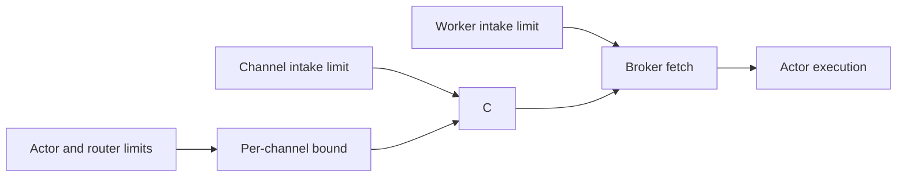

# Concurrency Limits

Concurrency limits keep a worker from taking more work than it can handle.
For example, you can use them to protect memory, database pools, external services, etc.

Repid has built-in numeric limits and application-defined limit policies:

| Type | Scope | Control |
| --- | --- | --- |
| `MessageLimits` | Worker and channel | Numeric broker-intake capacity |
| `ActorLimits` | Router and actor | Numeric post-routing execution capacity |
| `LimitPolicyT` | Every scope | Application-defined execution reservations |

=== "MessageLimits"

    ```python
    from repid import OnOversizedPayloadT

    MessageLimits(
        max_messages: int | None = None,
        max_payload_bytes: int | None = None,
        on_oversized_payload: OnOversizedPayloadT = "run_alone",
    )
    ```

=== "ActorLimits"

    ```python
    from repid import OnOversizedPayloadT

    ActorLimits(
        max_messages: int | None = None,
        max_payload_bytes: int | None = None,
        on_oversized_payload: OnOversizedPayloadT = "run_alone",
    )
    ```

- `max_messages` is the maximum number of in-flight messages. Use a positive integer or `None`.
- `max_payload_bytes` is the maximum total size of in-flight payloads. Use a positive
  integer or `None`.
- `on_oversized_payload` defines what happens when one payload is larger than a built-in
  byte limit. Can be `run_alone`, `reject`, `nack`, or a function that defines the policy
  `Callable[[ReceivedMessageT], Literal["run_alone", "reject", "nack"]]`.

## Default worker limit

A worker admits up to 1,000 messages by default:

```python
await app.run_worker()  # MessageLimits(max_messages=1000)
```

To remove this limit, pass an empty limits object:

```python
await app.run_worker(limits=MessageLimits())
```

Routers and actors have no default limits.

`tasks_limit` remains a deprecated alias for worker `max_messages`. Supplying it together with
`limits` is an error. `messages_limit` independently bounds the total number of processing attempts
in a run; oversized-disposed and unrouted deliveries do not consume that quota.

The runner accounts for delivered messages separately from admitted reservations. Already pushed
deliveries can exceed a local cap while waiting; they remain renewed and are admitted when reserved
capacity becomes available. Waiting deliveries never consume their own admission capacity.

??? Note "Why is the default 1,000 messages?"
    In tests, the processing overhead of receiving and scheduling about 1,000 to 2,000 no-op
    messages can saturate one CPU core. This number is based on Repid's
    message-consumption overhead, does not include any work done by your actors.

    When a worker takes more messages than its CPU can process, it can also take work away from
    less busy workers, thus the whole system becomes less efficient.
    The best value depends on your CPU, broker, and actors.
    Measure your workload and adjust the limit.

## Applying limits

Add limits at the scopes that own the resource:

```python
from repid import ActorLimits, Channel, MessageLimits, Router

router = Router(
    # All actors in this router share 20 execution slots.
    limits=ActorLimits(max_messages=20),
)


@router.actor(
    channel=Channel(
        address="video_jobs",
        # This channel may hold 100 messages or 256 MiB per worker.
        limits=MessageLimits(
            max_messages=100,
            max_payload_bytes=256 * 1024 * 1024,
        ),
    ),
    # This actor may run four calls at once.
    limits=ActorLimits(max_messages=4),
)
async def transcode(video_id: str) -> None: ...


# This worker may hold 500 messages across all channels.
await app.run_worker(limits=MessageLimits(max_messages=500))
```

### Sharing capacity

Reuse the same limits object to share capacity, or create one per actor to isolate them:

=== "Shared limits object"

    ```python
    # One object shared by both actors: the 12 slots are a common pool.
    database = ActorLimits(max_messages=12)


    @router.actor(channel="imports", limits=database)
    async def import_rows() -> None: ...


    @router.actor(channel="reports", limits=database)
    async def build_report() -> None: ...
    ```

    Both actors together can use 12 slots. For example, if `import_rows` is running on all
    12 slots, `build_report` waits until a slot is released.

=== "Separate limits objects"

    ```python
    # Two distinct objects: each actor gets its own independent pool of 12 slots.
    database_1 = ActorLimits(max_messages=12)
    database_2 = ActorLimits(max_messages=12)


    @router.actor(
        channel="imports",
        limits=database_1,  # 12 slots for this actor only
    )
    async def import_rows() -> None: ...


    @router.actor(
        channel="reports",
        limits=database_2,  # 12 more slots for this actor only
    )
    async def build_report() -> None: ...
    ```

    **Each** actor gets 12 slots, so up to 24 calls can run at once. One actor running on
    all of its slots never delays the other.

## Actor limits and broker intake

By default, Repid uses actor limits to reduce how much each channel fetches.
This prevents a worker from holding many messages that cannot run.


```mermaid
flowchart LR
    A[Actor and router limits] --> B[Per-channel bound]
    W[Worker intake limit] --> D
    H[Channel intake limit] --> C
    B --> C
    C --> D[Broker fetch]
    D --> E[Actor execution]
```

For example:

```python
@router.actor(channel="jobs", limits=ActorLimits(max_messages=3))
async def resize() -> None: ...


@router.actor(channel="jobs", limits=ActorLimits(max_messages=5))
async def index() -> None: ...
```

Repid can propagate an intake cap of 8 messages for channel `jobs`.
The actor limits still enforce 3 `resize` actor calls and 5 `index` actor calls.

Repid propagates each numeric field only when every actor on the channel has a finite limit for that
field along its router-and-actor path. Shared pools count once in the derived bound.
Byte propagation uses nominal budgets, including run-alone pools: two independent actors with
100-byte budgets derive a 200-byte channel budget, which can serialize two 150-byte messages even
though each actor could execute its message alone. Disable propagation to preserve that concurrency.

Disable propagation when you prefer explicit intake limits:

```python
await app.run_worker(actor_limits_propagation="off")
```

## Intake control

Local capacity, broker-native outstanding windows, and pause thresholds are independent.
Use `intake_control=` on the worker or a channel to configure the latter two:

```python
from repid import IntakeControl, MessageCountIntake, MessageLimits, PayloadByteIntake

await app.run_worker(
    limits=MessageLimits(max_messages=1000, max_payload_bytes=64 * 1024 * 1024),
    intake_control=IntakeControl(
        messages=MessageCountIntake(native="auto", pause_at=800, resume_at=600),
        payload_bytes=PayloadByteIntake(native="off"),
        pause_strategies=("channel_pause", "worker_pause"),
        on_unavailable="buffer",
    ),
)
```

The count and byte controls use their own units. `native="auto"` requests the effective
local cap only when the adapter advertises the corresponding outstanding-delivery guarantee.
`native="off"` disables that native dimension while retaining local enforcement.
An explicit positive integer requires that exact native window at the requested scope;
unsupported guarantees fail before subscription. A fetch batch size is not a native window.
Native windows remain useful without local caps, but early acknowledgment can release a native
slot while processing still holds local capacity.

Omitted pause thresholds use the effective local cap. Omitted resume thresholds use
`floor(0.75 * pause_at)`. A pause threshold must be positive and cannot exceed a finite local cap;
`resume_at` can be zero but must be below the pause threshold. Explicit thresholds without a local
cap provide soft flow control and can overshoot. Matching native windows avoid redundant numeric
pauses; actual admission or policy contention still requests pause.

Worker numeric settings apply to aggregate worker usage. Channels inherit strategy order,
unavailable behavior, native modes, and byte delivery mode, then derive thresholds and automatic
native values from their own effective caps. Absolute worker windows and thresholds are not copied
to each channel.

Pause strategies are tried in order:

| Strategy | Behavior |
| --- | --- |
| `"channel_pause"` | Soft-pause the affected channel; worker pressure pauses all channels. |
| `"worker_pause"` | Soft-pause the subscription, or all channels if only channel pause exists. |
| `"resubscribe"` | Stop intake, drain admitted work, then finish and replace the subscriber. |

The default order is channel pause, then worker pause. Unsupported strategies fall back to
buffering. Resubscription is opt-in: admitted work, including execution reservations still waiting
for capacity, must drain before replacement. It has no drain timeout; shutdown interrupts the wait.
Settlement and renewal resources remain available until the drain completes.

`on_unavailable="error"` requires a usable strategy for every numeric or possible policy trigger
before intake begins. Runtime failures of advertised operations fail the worker rather than
silently changing strategy. Independent pressure reasons must all recover before intake resumes.
Use `pause_strategies=()` with `on_unavailable="buffer"` to disable optional pause operations.

Byte controls also accept `oversized_delivery="deliver"` (the default) or `"allow_blocked"`.
Automatic native bytes fall back locally if the broker cannot deliver a single over-window message
in delivery mode. Explicit incompatible windows fail. Blocking requires an advertised blocking
mode: messages larger than the native byte window never reach Repid, even when the local byte
budget is larger. Their oversized callbacks cannot run. Blocking does not promise rejection,
nack, deletion, or dead-lettering.

Startup diagnostics report resolved local caps, native windows, thresholds, and fallback reasons.

NATS retains push consumers. New durable queue groups use the resolved channel count window as
`MaxAckPending`, shared across all workers bound to that consumer. Existing consumer settings are
preserved: automatic requests accept a stricter window or fall back locally when the shared window
is larger; explicit windows must match exactly and fail before delivery otherwise. Configure the
shared consumer centrally when different workers need a coordinated group budget. NATS aggregate
worker counts and byte budgets remain local.

There is no separate `BackpressurePolicy` API.

## Oversized payloads

`on_oversized_payload` applies when one payload is larger than `max_payload_bytes`.

| Value | Result |
| --- | --- |
| `"run_alone"` | Wait for current work to complete, then run this message alone. |
| `"nack"` | Nack without running the actor. |
| `"reject"` | Reject without running the actor. |

`"run_alone"` is the default. It makes `max_payload_bytes` a concurrency budget, not a maximum
allowed payload size. A waiting oversized payload gets priority over later, smaller messages in the
same pool.
Worker, channel, enclosing router, and actor oversized decisions are checked in that order before
waiting; the first reject or nack wins. A failing or invalid callback is logged without payload or
sensitive headers, and the message is nacked without stopping unrelated processing.

The policy can also be a synchronous function. Repid passes the received message and uses the
returned action:

```python
from repid import OversizedPayloadAction
from repid.connections import ReceivedMessageT


def choose_on_oversized_payload(message: ReceivedMessageT) -> OversizedPayloadAction:
    if message.headers and message.headers.get("priority") == "critical":
        return "run_alone"
    return "nack"


limits = MessageLimits(
    max_payload_bytes=10 * 1024 * 1024,
    on_oversized_payload=choose_on_oversized_payload,
)
```

## Custom limit policies

A `LimitPolicyT` is an asynchronous reservation strategy. Its `reserve` method returns a fresh
async context manager for every call; entering the context acquires capacity and exiting releases
it. It receives the message, selected actor, and an `on_capacity_exhausted` callback:

```python
from collections.abc import Awaitable, AsyncIterator, Callable
from contextlib import AbstractAsyncContextManager, asynccontextmanager
from repid import LimitPolicyT
from repid.connections import ReceivedMessageT
from repid.data import ActorData


class WorkLimitPolicy:
    def reserve(
        self,
        message: ReceivedMessageT,
        actor: ActorData,
        on_capacity_exhausted: Callable[[], Awaitable[None]],
    ) -> AbstractAsyncContextManager[None]: ...
```

The policy calculates cost and reserves capacity. When it knows capacity is unavailable, it calls
`await on_capacity_exhausted()` **before** waiting for capacity. The callback is idempotent per
reservation attempt: repeated calls contribute only one capacity-wait registration, and Repid
clears that attempt's contribution as soon as the context entry succeeds, fails, or is cancelled.
Do not call it for pricing I/O or acquisition-request latency — only when the policy actually
knows it must wait for capacity.

Entering the context must acquire the resource; exiting must release it. Here is a local policy
where each message costs one work unit:

```python
import asyncio
from contextlib import asynccontextmanager
from typing import TYPE_CHECKING

if TYPE_CHECKING:
    from repid.connections import ReceivedMessageT
    from repid.data import ActorData


class WorkLimitPolicy:
    def __init__(self, capacity: int) -> None:
        if capacity < 1:
            raise ValueError("capacity must be positive")
        self.capacity = capacity
        self.used = 0
        self.ready = asyncio.Condition()

    def reserve(self, message, actor, on_capacity_exhausted):
        return self._reservation(on_capacity_exhausted)

    @asynccontextmanager
    async def _reservation(
        self,
        on_capacity_exhausted: Callable[[], Awaitable[None]],
    ) -> AsyncIterator[None]:
        async with self.ready:
            if self.used >= self.capacity:
                # We know capacity is unavailable: notify before waiting.
                await on_capacity_exhausted()
                await self.ready.wait_for(lambda: self.used < self.capacity)
            self.used += 1
        try:
            yield
        finally:
            async with self.ready:
                self.used -= 1
                self.ready.notify_all()


work: LimitPolicyT = WorkLimitPolicy(capacity=100)
```

Rules every policy must follow:

- Exit the context in a `finally` block, so capacity is released even when processing fails
  or is cancelled.
- Propagate processing failures rather than suppressing them.
- Roll back any partial acquisition when the entry itself fails, and perform
  cancellation-safe backend operations where needed (Repid composes entered contexts
  with `AsyncExitStack` and exits them in reverse order).
- Entering a context is not part of the actor execution timeout; reservations remain held
  until processing and middleware unwinding end.

### Explicit contention notification

`on_capacity_exhausted` tells Repid that a reservation is waiting for capacity, so Repid can
apply broker backpressure (pausing intake) while the reservation waits. Repid's callback is
idempotent per reservation attempt, and overlapping attempts are independently accounted for —
completing one never resumes intake still paused by another.

Some backends only expose an opaque blocking acquisition call. Without backend support you
cannot know precisely when you start waiting. You can conservatively call
`await on_capacity_exhausted()` right before acquiring, or omit the notification entirely and
rely on numeric intake bounds to bound concurrent work.

Distributed policies (a shared backend such as Redis or a database) must provide
expiry or recovery for process death and handle ambiguous remote acquisition outcomes
themselves — a crashed worker cannot release its reservations.

### Migration

!!! warning "Interface migration"
    Earlier versions asked policies for reservation *leases* returned by an
    `async def reserve(...) -> ReservationLeaseT` method with an `on_wait` callback.
    Both are gone: policies now return async context managers and report contention
    through `on_capacity_exhausted`. There is no compatibility shim for leases.

Custom limit policies are never translated to broker-native limits or propagated to channel intake.

If pricing can fail, handle the fallback inside `reserve()`.
Repid treats an unhandled policy error as a worker failure: it stops new intake
and marks the worker unhealthy when health checks are enabled.

### Applying custom limit policies

Pass `limit_policies=` at any scope, the same way as `limits=`. Repid deduplicates policies by
identity, so a message reserves capacity in the same policy only once, even when that policy
appears at several scopes on its way through the worker:

=== "Same policy instance"

    ```python
    from repid import Channel, Router

    # One instance reused at every scope: capacity=100 is a single global pool.
    work: LimitPolicyT = WorkLimitPolicy(capacity=100)  # defined in "Custom limit policies" below

    channel = Channel(address="jobs", limit_policies=(work,))
    router = Router(limit_policies=(work,))


    @router.actor(channel=channel, limit_policies=(work,))
    async def process() -> None: ...


    await app.run_worker(limit_policies=(work,))
    ```

    A message for `process` passes through the worker, the `jobs` channel, the router, and
    the actor, all sharing the same `work` policy instance.
    Repid reserves a single slot for it, so 100 messages can run at once.

=== "Separate policy instances"

    ```python
    from repid import Channel, Router

    # Four distinct instances: every scope enforces its own independent pool of 100.
    worker_policy: LimitPolicyT = WorkLimitPolicy(capacity=100)
    channel_policy: LimitPolicyT = WorkLimitPolicy(capacity=100)
    router_policy: LimitPolicyT = WorkLimitPolicy(capacity=100)
    actor_policy: LimitPolicyT = WorkLimitPolicy(capacity=100)

    channel = Channel(address="jobs", limit_policies=(channel_policy,))
    router = Router(limit_policies=(router_policy,))


    @router.actor(channel=channel, limit_policies=(actor_policy,))
    async def process() -> None: ...


    await app.run_worker(limit_policies=(worker_policy,))
    ```

    Each scope enforces its own 100 slots, and one message reserves a slot in **all four**
    policy instances on its way through.

## Caveats

- Built-in limits apply to one worker process.
- `max_payload_bytes` measures serialized payloads. Parsed Python objects may use more memory.
- A broker may have sent messages before a pause takes effect. The process can briefly hold more
  than the configured amount.
- A channel pause can delay other actors on the same channel.
- `"buffer"` can cause unbounded buffering when no numeric intake limit exists.
- A custom limit policy defines its own fairness and oversized behavior.
