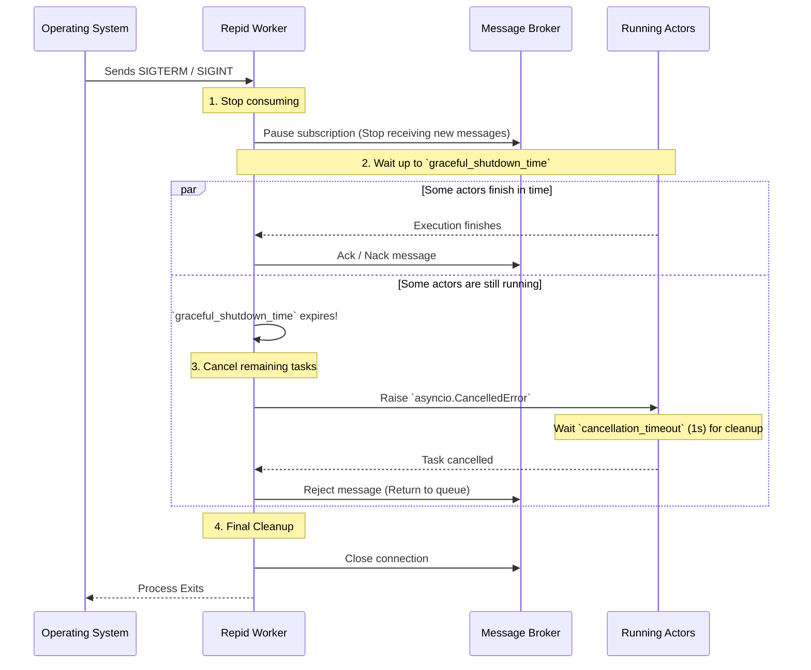

# Worker Lifecycle & Production

When moving your Repid applications from local development into a production environment (like
Docker or Kubernetes), there are a few major considerations for workers, primarily how they handle
OS signals and shutdown sequences.

## The Worker Loop

A Repid worker runs as a standalone, blocking event loop. It connects to your message broker and
waits for new tasks (either by listening to a push-based subscription or by polling, depending on
the specific broker).

Because Repid natively manages its own `asyncio` execution lifecycle, it does not require an
external ASGI runner (like `uvicorn` or `gunicorn`) to operate. However, the best practice is to run
this worker as a completely independent background process, separate from your main web application.

```python title="worker.py"
import asyncio
from app import app # your Repid app instance

async def main():
    async with app.servers.default.connection():
        # Starts the worker event loop and blocks until shutdown signal
        await app.run_worker()

if __name__ == "__main__":
    asyncio.run(main())
```

## Graceful Shutdowns

When you stop a worker (e.g., during a deployment rollout), the OS sends a termination signal
(`SIGTERM` or `SIGINT`) to the process. If the process dies immediately, any messages that actors
were currently executing might be lost or stuck in an ambiguous state.

Repid handles these signals automatically to ensure a **graceful shutdown**. This prevents data loss
and allows messages to be safely returned to the broker if they cannot finish in time.

### The Shutdown Sequence

Here is exactly what happens when a Repid worker receives a termination signal:



1. **Pause Subscription**: The worker immediately stops accepting *new* messages from the broker.
2. **Grace Period**: It enters a waiting phase (determined by `graceful_shutdown_time`), allowing
   currently executing actors to finish their processing naturally.
3. **Cancellation (if necessary)**: If the timeout is reached and actors are still running, Repid
   triggers an `asyncio.CancelledError` inside those tasks. They are given a brief moment
   (`cancellation_timeout`, defaulting to 1s) to run any `finally` blocks, while the worker
   simultaneously `Reject`s their messages, returning them to the queue so another worker can
   pick them up.
4. **Disconnect**: Finally, the worker safely closes its connection to the broker and shuts down the
   process.

### Configuring the Shutdown Timeout

By default, Repid gives actors **25 seconds** to finish after a shutdown signal is received.

!!! note
    The default is 25 seconds because orchestrators like Kubernetes usually
    wait 30 seconds between sending `SIGTERM` and `SIGKILL`.
    The 5-second buffer ensures Repid can properly cancel tasks
    and Reject messages before the hard kill.

If your actors take longer to run, you can increase this timeout—just remember to also increase your
orchestrator's termination grace period!

```python
await app.run_worker(
    graceful_shutdown_time=120.0  # Wait up to 2 minutes
)
```

By ensuring that messages are always properly Acked, Nacked, or Rejected during a deployment
rollout, Repid guarantees that your task queue remains consistent and reliable.

### Custom Shutdown Signals

By default, Repid listens for `SIGTERM` and `SIGINT` signals to trigger graceful shutdown. You can
customize which signals the worker responds to or disable it entirely.

To specify custom signals:

```python
import signal

await app.run_worker(
    register_signals=[signal.SIGUSR1]
)
```

To disable Repid listening for signals:

```python
await app.run_worker(
    register_signals=[]  # No signals will trigger graceful shutdown
)
```

!!! warning
    Disabling signal registration prevents graceful shutdown,
    risking message loss or inconsistent state during termination.
    Only disable this when you have alternative mechanisms to
    ensure message safety.
