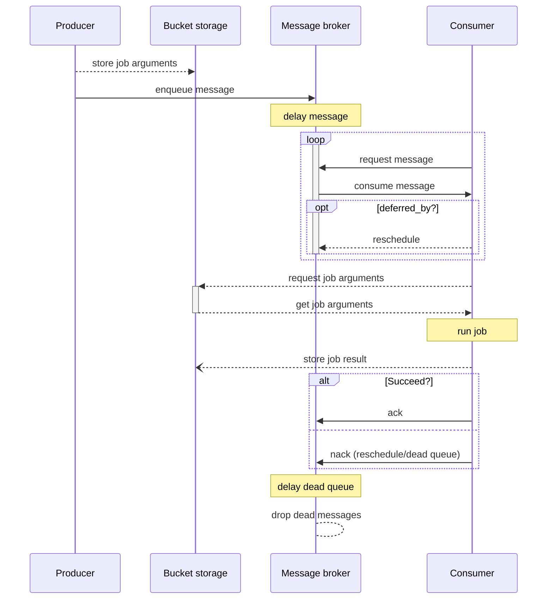

```mermaid
sequenceDiagram
  participant P as Producer
  participant B as Bucket storage
  participant M as Message broker
  participant C as Consumer
  P-->>B: store job arguments
  P->>M: enqueue message
  Note over M: delay message
  loop
    activate M
    C->>M: request message
    M->>C: consume message
    opt deferred_by?
      C-->>M: reschedule
    end
    deactivate M
  end
  C-->>+B: request job arguments
  B-->>-C: get job arguments
  Note over C: run job
  C--)B: store job result
  alt Succeed?
    C->>M: ack
  else
    C->>M: nack (reschedule/dead queue)
  end
  note over M: delay dead queue
  M-->M: drop dead messages
```
